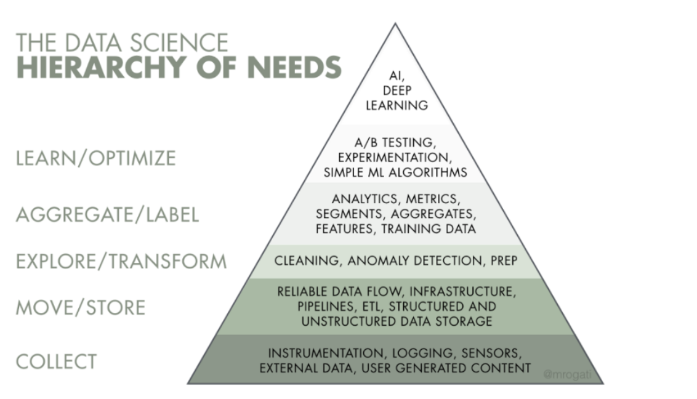

# Learning-Resources

This is a collection of pdfs and ebooks related to Big Data, Machine Learning and Cloud that I have collected from my experience.

You can download most books from this Deep Web site called Imperial Library of Trantor (http://xfmro77i3lixucja.onion/). There is a Tor2Web proxy if you don't have TorBrowser (https://xfmro77i3lixucja.onion.sh), but I strongly advice against using it because it gets to see EVERYTHING- Your credentials if you sign in, any cookies, any uploads you make, all the pages you request and their contents etc. This pretty much defeats the purpose of anonymity. Another really cool website for books is Z-Library (https://z-lib.org/ or http://loginlibhuwhnmis.onion/).

Copyright laws are obsolete. With the technology to copy books without cost we can finally have universal access to the knowledge and enlightenment. We can provide the tools to allow everybody to read and learn without the interference of capitalist greed. 

If you have a specific request, feel free to email me at srpatil@uci.edu.
